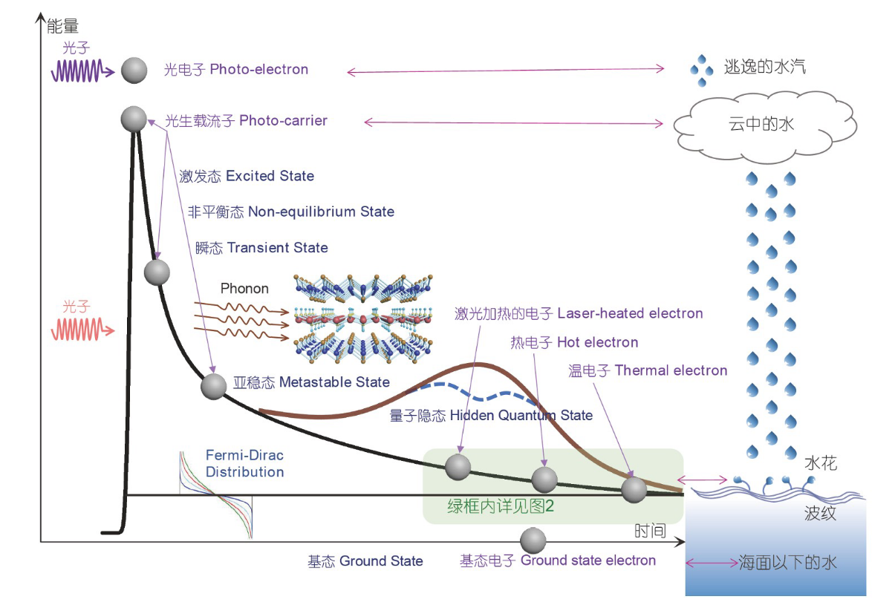
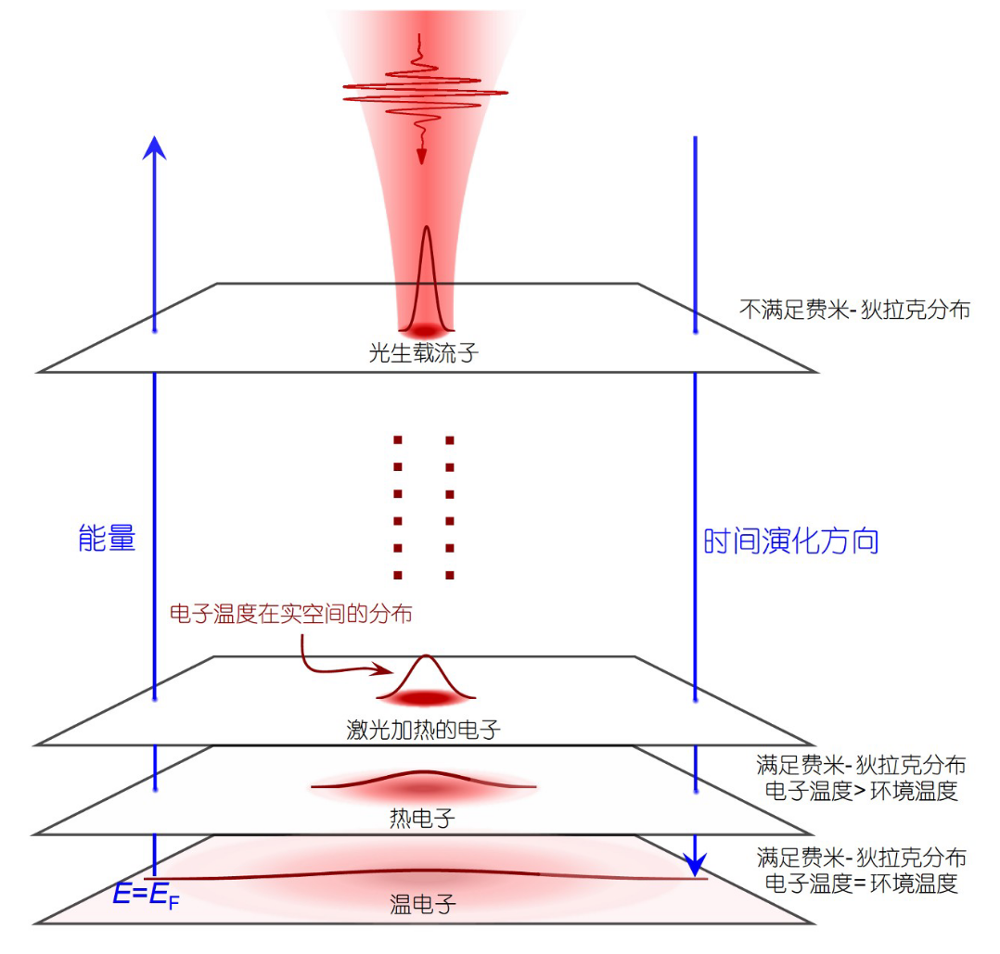

参考
paper：

## 光激发非平衡电子弛豫示意图

## 光激发非平衡态电子分类

### 光生载流子(photo-carrier)

#### 定义与特征
- 基态电子受到光激发后的激发状态（非平衡）
- 不满足fermi-dirac 分布，无法用此定义温度；
- 激发时与与晶格温度不一致，存在二温度图像($T_{e},T_{L}$)
- 在激发1fs寿命，具有相干相位，称为相干时域
- 不会溢出固体

激子超快动力学的反应路径图景
	e-ph ph-ph e-rb spin-spin spin-lattice ex-ex 

note：相较于光电子(___photo electron___ ，接近真空能级），文中的电子能量均较低，不会溢出

#### 光生载流子的超快弛豫过程描述

通过多个通道进行弛豫，每个通道通过指数衰减进行拟合
$$
\frac{\Delta R}{R}=\Sigma_{i}A_{i} \cdot e^{-t/\tau_{i}}
$$
根据[[费米黄金法则(Fermi's Golden Rule)]]，弱探测的微分反射率大小正比光生载流子浓度
$i$代表不同的衰减过程，主要包括下面类型：

- 电子-声子耦合(___electron-phonon coupling___)
- 声子-声子散射(phonon-phonon scattering)
- 电子-空穴对符合(___electron-hole recombination___)
（其他散射通道）
- 自旋-自旋散射(___spin-spin scattering___)
- 自旋-晶格散射(___spin-lattice scattering___)
- 激子-激子散射
- 其他极化激元散射

##### 主要过程
 1. 光生载流子与高频声子作用(e-ph)；耦合强度一般是恒定的
 2. 高频声子通过声子-声子散射分解成较低能量光学支声子和声学支声子(ph-ph)，最终都变成声学声子

##### 两个重要分量
快分量(___fast component___, $\tau_{fast}$)：光生载流子-晶格弛豫，1ps尺度；
慢分量(___slow component___, $\tau_{slow}$)：声子-声子散射（决定[[声子瓶颈效应]]），several ps to hundred ps尺度；在超导体、电荷密度波等材料中

### 激光加热电子(laser-heated electron)、热电子(hot electron)、温电子(thermal electron)

- 这三种类型电子描述为，光生载流子通过两种弛豫过程后，在接近激光热平衡到基态的能量区间内的不同电子，其能量分布特征如下所示

- 这三类电子的弛豫过程以e-ph散射与ph-ph散射为主
- 电子不相干，且不会溢出固体

#### 激光加热电子
- 光生载流子经过超快弛豫过程，与激光照射点附近局部晶格达到较小范围热平衡形成
- 满足 ___fermi-dirac___ 分布，空间主要分布在激光照射范围

#### 热电子
- 热平衡体系从激光点位置向外扩散，但电子有效温度依然高于环境温度
- 处在激光加热电子和最终态的温电子之间
- note：受到其他场激发（热激发、电场激发）的电子也可称为热电子

#### 温电子
- 热平衡体系扩散到足够大范围，扩散停止
- 电子有效温度几乎等于晶格温度（环境温度）
- 电子回到激发前状态

注：
实验上：为避免激光重复频率过大导致的持续热效应，先进行光通量依赖实验，试探是否有热效应
方法：观测微分反射率绝对值的最大值是否与泵浦 光通量存在线性依赖关系